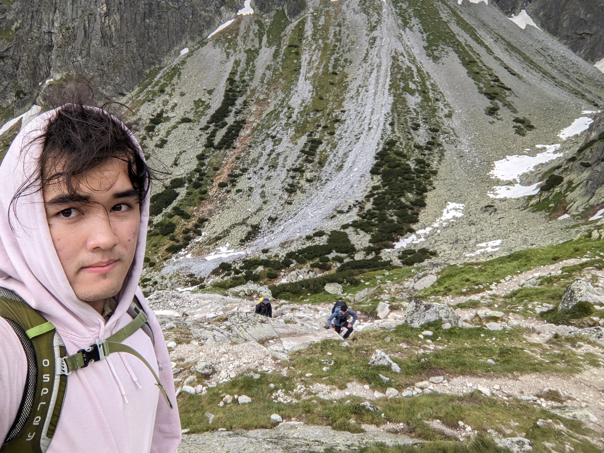

## I am a computer scientist. 
I've explored many fields of computer science, including but not limited to web scraping, game development, data structures and algorithms, and web development. Currently, my biggest interest lies in the field of graphical programming. Some of my favorite projects in the field include a GPU path tracer, a terminal rasterizer, and a handful of various shaders to spice up my renders. I've also built websites from the ground up, competed in game jams, and done much more to push the boundaries of my computer science knowledge. I always want to learn more about the field!

## I am a student.
After completing the IB in Hong Kong, I moved to the United States to persue a degree in Computer Science and Engineering. I'm currently enrolled in the University of California, Davis. I always take my studies seriously and try to push the limits of my knowledge both inside and outside the classroom, which is why I always have personal projects to work on. There's always more to know and more to learn! 

